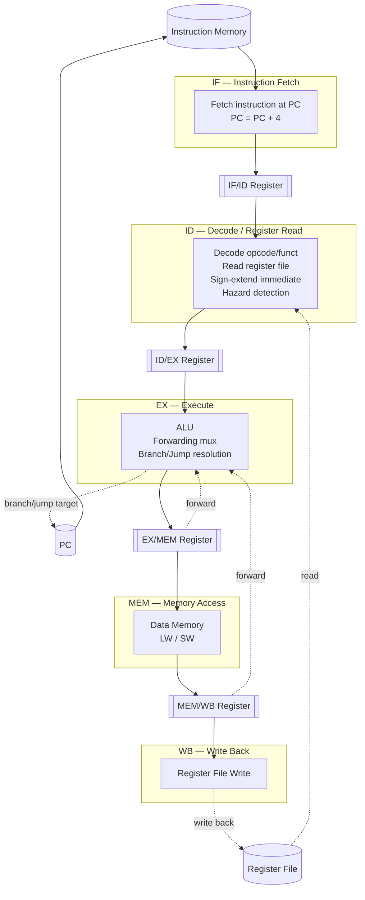

# MIPS32 5-Stage Pipelined Processor Simulator

A C++17 software simulator of a subset of the MIPS32 instruction set, modeled as a classic 5-stage pipelined datapath (IF, ID, EX, MEM, WB). The simulator executes 32-bit machine-code programs, implements data forwarding and load-use hazard detection, handles control-flow flushing for taken branches and jumps, and prints a cycle-by-cycle view of the pipeline along with end-of-run performance statistics.

## Overview

This project implements a **MIPS32 subset** processor — not a full MIPS ISA — as a cycle-accurate pipeline simulator. It models four pipeline registers (IF/ID, ID/EX, EX/MEM, MEM/WB), a 32-register file, byte-addressable big-endian data memory, and the control logic needed to resolve data and control hazards in a 5-stage pipeline.

The goal of the project is to build hands-on understanding of:

- How instructions move through fetch, decode, execute, memory, and write-back stages
- How pipeline registers isolate one stage's state from the next
- How data hazards arise between overlapping instructions, and how forwarding resolves most of them
- Why a load-use hazard specifically cannot be solved by forwarding alone and requires a stall
- How taken branches and jumps introduce control hazards, and how the pipeline is flushed to discard wrong-path instructions
- How cycle count, stalls, and flushes combine to determine CPI (cycles per instruction) as a practical measure of pipeline performance

## Features

- MIPS32 instruction decoding (R-type, I-type, J-type)
- 32-register general-purpose register file, with `$zero` hardwired to 0
- Byte-addressable data memory with big-endian word access
- Instruction memory loaded from hexadecimal machine-code files
- ALU supporting arithmetic, logical, and comparison operations
- Full 5-stage pipeline execution (IF → ID → EX → MEM → WB)
- Data forwarding from EX/MEM and MEM/WB into the EX stage (including forwarding to branch comparisons)
- Load-use hazard detection with a one-cycle pipeline stall
- Branch resolution (BEQ, BNE) and jump resolution (J) in the EX stage
- Pipeline flushing of wrong-path instructions after a taken branch or jump
- Cycle-by-cycle pipeline state visualization printed to the console
- End-of-run performance statistics, including CPI

## Supported Instruction Set

| Instruction | Type | Operation / Description |
|---|---|---|
| `ADD` | R | `rd = rs + rt` |
| `SUB` | R | `rd = rs - rt` |
| `AND` | R | `rd = rs & rt` |
| `OR` | R | `rd = rs \| rt` |
| `SLT` | R | `rd = (rs < rt) ? 1 : 0` (signed comparison) |
| `NOP` | R | No operation (all-zero encoding) |
| `ADDI` | I | `rt = rs + sign_extend(immediate)` |
| `LW` | I | `rt = Memory[rs + sign_extend(immediate)]` (32-bit word) |
| `SW` | I | `Memory[rs + sign_extend(immediate)] = rt` (32-bit word) |
| `BEQ` | I | Branch to `PC + 4 + (immediate << 2)` if `rs == rt` |
| `BNE` | I | Branch to `PC + 4 + (immediate << 2)` if `rs != rt` |
| `J` | J | Jump to `((PC + 4) & 0xF0000000) \| (address << 2)` |

Any encoding that does not match one of these opcodes/funct codes is decoded as `INVALID` and is not executed.

## System Architecture



The register file, ALU, forwarding paths, hazard detection logic, and control-flow redirection back to PC are shown as part of the ID and EX stages, where they are actually implemented.

## 5-Stage Pipeline

- **IF (Instruction Fetch)** — Reads the instruction at the current PC from instruction memory and advances PC by 4. The fetched instruction is latched into the IF/ID register.
- **ID (Instruction Decode / Register Read)** — Decodes the opcode/funct fields into an operation, reads the source registers, sign-extends the immediate field, and computes branch/jump target addresses. Load-use hazard detection also happens here, before the instruction is latched into ID/EX.
- **EX (Execute / Branch Resolution)** — Performs the ALU operation (or address calculation for `LW`/`SW`), applies forwarded operands from EX/MEM and MEM/WB where needed, and resolves `BEQ`/`BNE`/`J` by redirecting PC when the branch is taken or the jump executes.
- **MEM (Memory Access)** — Performs the actual data memory read for `LW` or write for `SW`, using the address computed in EX. All other instructions simply pass their ALU result through this stage.
- **WB (Write Back)** — Writes the final result (ALU result or loaded memory value) back into the destination register.

## Pipeline Hazards

**Data hazards and forwarding.** When one instruction needs a value that a previous, still in-flight instruction hasn't written back yet, the EX stage forwards the result from EX/MEM or MEM/WB directly into the ALU's operand inputs (and into branch comparisons), instead of waiting for the value to reach the register file.

**Load-use hazard.** Forwarding cannot solve every case. Consider:

```
LW  $t0, 0($t1)
ADD $t3, $t0, $t2
```

At the moment `ADD` is in EX, the result of `LW` hasn't been read from memory yet — `LW` is still one stage behind, in MEM. There is no value to forward. The simulator detects this specific case (a load in ID/EX whose destination register matches a source register of the instruction in IF/ID) and inserts **one stall cycle**: the ID/EX stage is turned into a bubble, and IF/ID is held so the `ADD` is re-decoded one cycle later, by which time the loaded value can be forwarded from MEM/WB.

**Control hazards.** `BEQ`, `BNE`, and `J` are resolved in the EX stage, by which point the two following instructions have already been fetched into IF/ID and ID/EX. If the branch is taken (or for any `J`), those two pipeline slots hold wrong-path instructions and are flushed — invalidated so they do not execute or write back — while PC is redirected to the correct target.

## Pipeline Visualization

Each cycle, the simulator prints the operation occupying each pipeline register (IF/ID, ID/EX, EX/MEM, MEM/WB), the event for that cycle (`NORMAL`, `STALL`, or `FLUSH`), and a snapshot of registers `$t0`–`$t4`. A run based on the load-use example above looks conceptually like:

| Cycle | IF/ID | ID/EX | EX/MEM | MEM/WB | Event |
|------:|-------|--------|--------|--------|-------|
| 1 | LW | — | — | — | NORMAL |
| 2 | ADD | LW | — | — | NORMAL |
| 3 | ADD | BUBBLE | LW | — | STALL |
| 4 | — | ADD | — | LW | NORMAL |

This table is illustrative of the format the simulator prints; actual cycle contents depend on the program being executed.

## Performance Statistics

At the end of a run, the simulator reports:

- **Total cycles** — number of clock cycles executed
- **Instructions retired** — number of instructions that completed write-back (or, for branches and jumps, completed EX)
- **Load-use stalls** — number of cycles in which a load-use bubble was inserted
- **Control-flow flushes** — number of taken branches/jumps that caused a flush
- **Instructions flushed** — number of wrong-path instructions discarded
- **CPI** — cycles per instruction, computed as:

```
CPI = Total Cycles / Instructions Retired
```

## Input Format

The current version accepts **hexadecimal machine code only**, one 32-bit instruction per line, in a plain text file:

```
8D280000
010A5820
```

These two lines encode:

```
LW  $t0, 0($t1)
ADD $t3, $t0, $t2
```

Assembly-language input is **not** currently supported. It is listed under Future Improvements as a possible enhancement.

## Build and Run

Build with g++ (C++17):

```bash
g++ -std=c++17 -Iinclude src/main.cpp src/CPU.cpp src/Instruction.cpp src/Decoder.cpp src/ALU.cpp src/Pipeline.cpp src/ProgramLoader.cpp -o mips-sim
```

Run:

```bash
./mips-sim programs/load_use.txt
```

On Windows PowerShell:

```powershell
.\mips-sim.exe programs/load_use.txt
```

## Project Structure

```
mips_simulator/
├── include/
│   ├── ALU.h
│   ├── CPU.h
│   ├── Decoder.h
│   ├── Instruction.h
│   ├── Pipeline.h
│   └── ProgramLoader.h
├── src/
│   ├── ALU.cpp
│   ├── CPU.cpp
│   ├── Decoder.cpp
│   ├── Instruction.cpp
│   ├── Pipeline.cpp
│   ├── ProgramLoader.cpp
│   └── main.cpp
├── programs/
│   ├── arithmetic.txt
│   ├── bne.txt
│   ├── branch_not_taken.txt
│   ├── branch_taken.txt
│   ├── forwarding.txt
│   ├── hazard.txt
│   ├── jump.txt
│   ├── load_use.txt
│   └── memory.txt
└── README.md
```

`Pipeline.h` defines the IF/ID, ID/EX, EX/MEM, and MEM/WB register structs; there is no corresponding `Pipeline.cpp`, since these are plain data structures used directly by `CPU`.

## Example

Program (`programs/load_use.txt`):

```
8D280000    ; LW  $t0, 0($t1)
010A5820    ; ADD $t3, $t0, $t2
```

Initial state:

```
$t1 = 10
$t2 = 5
Memory[10] = 30
```

Expected behavior: `ADD` depends on the value loaded by the immediately preceding `LW`. Because that value is not yet available for forwarding when `ADD` reaches EX, the pipeline inserts one stall cycle before `ADD` proceeds.

Final result:

```
$t0 = 30
$t3 = 35
```

## Design Decisions

- **C++17** was chosen for modern language features (structured, `<cstdint>` fixed-width types, clean struct initialization) while remaining close to the underlying hardware model being simulated.
- A **5-stage pipeline** (IF, ID, EX, MEM, WB) was chosen because it is the canonical educational pipeline model used to teach hazards, forwarding, and control-flow handling in computer architecture courses.
- **Pipeline registers are explicitly represented** as structs (`IF_ID`, `ID_EX`, `EX_MEM`, `MEM_WB`) with `valid` flags, rather than implied by function calls, so that bubbles, stalls, and flushes can be modeled precisely as state transitions between cycles.
- **Hazards are explicitly modeled** — load-use detection and forwarding logic are implemented as dedicated functions/branches in `CPU`, rather than assumed away, so the simulator reflects real pipeline behavior rather than an idealized one-instruction-per-cycle model.
- **Machine-code input is currently used** rather than assembly, keeping the decoder and loader simple while the pipeline/hazard logic (the core learning objective of the project) is developed and verified first.

## Testing

The repository does not currently contain an automated test suite (e.g. a `tests/` directory or unit-testing framework). Verification is currently done by running the sample programs in `programs/` through the simulator and inspecting the printed pipeline trace and final register/memory state:

- `arithmetic.txt` — R-type ALU operations
- `memory.txt` — `LW`/`SW` memory access
- `forwarding.txt` — back-to-back dependent ALU instructions (EX/MEM and MEM/WB forwarding)
- `load_use.txt` — the load-use hazard and its one-cycle stall
- `branch_taken.txt` / `branch_not_taken.txt` — `BEQ` resolution and flushing behavior
- `bne.txt` — `BNE` resolution
- `jump.txt` — `J` resolution and flushing behavior
- `hazard.txt` — currently an empty program file

## Future Improvements

The following are **not implemented** and are listed only as possible future work:

- Assembly parser / assembler (so the simulator can accept `.asm`-style input instead of raw hex)
- Additional MIPS32 instructions (e.g. more branch, shift, and multiply/divide operations)
- A more comprehensive, automated test suite
- Branch prediction (the simulator currently resolves branches in EX with no prediction — every taken branch/jump causes a two-instruction flush)
- More detailed pipeline visualization (e.g. showing full instruction operands, not just the operation mnemonic)
- Interactive/step-through debugging
- Configurable memory size (currently fixed at 1 KB of data memory)
- Cache simulation
- More detailed performance analysis beyond total cycles, stalls, flushes, and CPI

## Learning Outcomes

Building this simulator provides practical, implementation-level understanding of core Computer Organization and Architecture concepts: instruction encoding and decoding, datapath staging, the purpose and structure of pipeline registers, the distinction between data and control hazards, why forwarding resolves most data hazards but not load-use dependencies, how control-flow instructions force pipeline flushes, and how these effects are captured quantitatively through CPI.

## Author

Parth Dembla
B.Tech Electrical Engineering, IIT Gandhinagar
